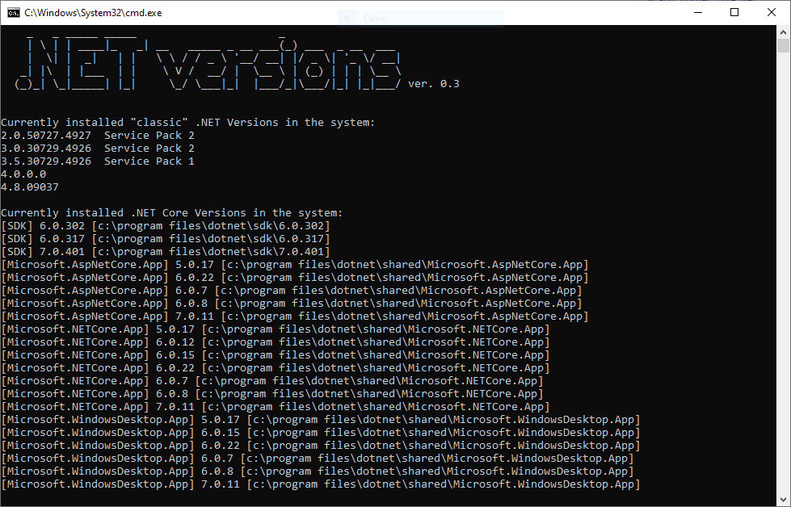

# dotnetversionsgo
Command line tool that shows the currently installed "classic" .NET versions in your system. The main difference from the **dotnetversion** project is the lack of dependency on .NET Framework

## Getting Started

    ./dotnetversionsgo.exe

## Built With

1. GO 1.21.0
2. golang.org/x/sys/windows/registry

## License

This project is licensed under the MIT License - see the [LICENSE.md](LICENSE.md) file for details

## Acknowledgments

Thanks to the project https://github.com/jmalarcon/DotNetVersions
